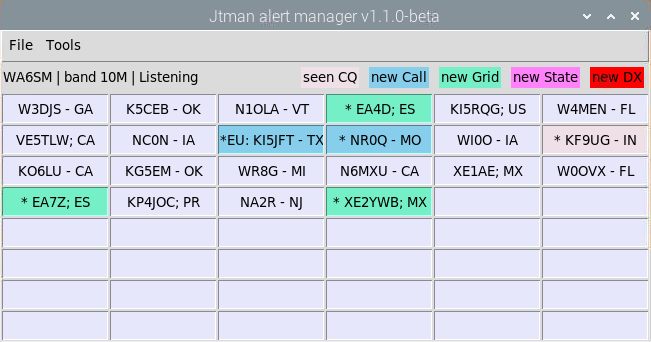

# jtman

Author: WA6SM

works with wsjtx and lotw to alert you to new dx, state, and callsign contacts.



Run: ``CONFIG=my_config.ini python3 main.py``

see the default config.ini for placeholder options.

### Install on Ubuntu 20.04
```bash
git clone https://github.com/josh3io/jtman.git
cd jtman
git submodule update --init --recursive
```
copy config.ini to my_config.ini and update as necessary, then run as above.

For installation of required libraries:
```bash
sudo apt-get install python3-tk
sudo apt-get install libatlas-base-dev
pip3 install termcolor
pip3 install adif_io
pip3 install pyhamtools
pip3 install pandas
```
